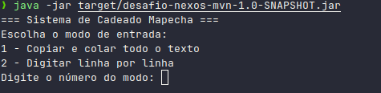
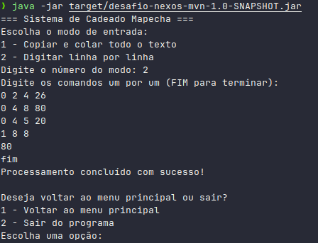

# Desafio: Implementação do Segredo do Cadeado Mapecha

## Descrição

Os Mapechas são uma importante comunidade da bacia do rio Bilkendur. Eles utilizam cadeados codificados para transportar produtos entre as margens do rio, acompanhados de uma carta codificada com uma sequência de números. Sua tarefa é desenvolver um programa que processe essa sequência de números e gere a saída correta para abrir o cadeado.

---

## Regras de Processamento

- **Regra 1:**
  `0 t q i`
  Adicione `i` a todos os números na faixa de índices de `t` a `q` (inclusive).

- **Regra 2:**
  `1 t q`
  Imprima a soma dos elementos do array entre os índices `t` e `q` (inclusive) e, em seguida, zere todas as posições do array.
  **Atenção:** Se o resultado já foi impresso anteriormente, não imprima novamente, mas ainda assim limpe o array.

> **Observação:**
> Os valores de `t` e `q` devem ser menores que 100.

---

## Exemplo de Entrada e Saída

### Entrada

```
0 2 4 26
0 4 8 80
0 4 5 20
1 8 8
FIM
```

### Saída

```
80
```

---

## Estrutura de Pastas do Projeto

```
src/
  └── main/
      └── java/
          └── org.example/
              ├── ci/              # Interface de linha de comando
              ├── model/           # Modelos de dados do sistema
              ├── processor/       # Processadores e estratégias de regras
              ├── CadeadoHandler   # Manipulador principal do sistema
              └── Main             # Ponto de entrada da aplicação
```

---

## Como Executar o Projeto

**Pré-requisitos:**
- Java 21 ou superior

**Para compilar e executar:**
```sh
mvn clean package
java -jar target/desafio-nexos-mvn-1.0-SNAPSHOT.jar
```

**Ou apenas execute o JAR:**
```sh
java -jar desafio-nexos-mvn-1.0-SNAPSHOT.jar
```

---

## Modos de Entrada

O sistema possui dois modos de entrada:

### 1. Copiar e colar todo o texto (Modo 1)

O usuário pode colar todas as linhas de uma vez. O sistema processa tudo ao final.

```sh
=== Sistema de Cadeado Mapecha ===
Escolha o modo de entrada:
1 - Copiar e colar todo o texto
2 - Digitar linha por linha
Digite o número do modo: 1
Cole todo o texto abaixo (termine com FIM):
0 2 4 26
0 4 8 80
0 4 5 20
1 8 8
fim

80 -- saída do sistema
Processando todas as linhas...
```

### 2. Digitar linha por linha (Modo 2)

O usuário digita cada linha e o sistema processa imediatamente. Para sair, digite "FIM".

```sh
=== Sistema de Cadeado Mapecha ===
Escolha o modo de entrada:
1 - Copiar e colar todo o texto
2 - Digitar linha por linha
Digite o número do modo: 2
Digite os comandos um por um (FIM para terminar):
0 2 4 26
0 4 8 80
0 4 5 20
1 8 8
80 -- saída do sistema
fim
Processamento concluído com sucesso!
```

---

## Validações

1. **Fim da entrada:**
   O sistema não diferencia maiúsculas de minúsculas para "FIM" (aceita "FIM", "fim", etc.).

2. **Formato do comando:**
   - O primeiro número deve ser `0` ou `1`.
   - Se for `0`, a linha deve conter **4 números** separados por espaço.
   - Se for `1`, a linha deve conter **3 números** separados por espaço.
   - Qualquer outro valor ou quantidade incorreta de colunas dispara um erro.

3. **Caracteres válidos:**
   Apenas números e espaços são aceitos. Qualquer caractere especial dispara um erro.

4. **Limite dos índices:**
   Os valores de `t` e `q` devem ser menores que 100.

5. **Valor de incremento:**
   O valor de `i` deve ser um número inteiro positivo.

---

## Solução em Nível de Design de Código

O projeto utiliza o padrão Strategy para garantir clareza, responsabilidade única e aderência ao princípio Open/Closed.

- **EntradaStrategy:**
  Interface que define o método de entrada. Atualmente, há duas implementações: uma para o modo de entrada 1 (texto completo) e outra para o modo de entrada 2 (linha interativa). Para adicionar um novo modo de entrada, basta criar uma nova implementação dessa interface.

- **RegraStrategy:**
  Interface que define o método de processamento das regras. Existem duas implementações: uma para a regra 0 (soma do valor do índice para todos os índices no range solicitado) e outra para a regra 1 (soma dos valores do array e posterior zeragem dos valores).Se um novo tipo de regra for necessário, basta criar uma nova implementação dessa interface e implementar a lógica desejada, não sendo necessário alterar o código existente.

Também foi utilizado o padrão factory para criar as instâncias corretas de acordo com o tipo de entrada e regra, tanto para a entrada quanto para o processamento das regras.

---

## Observações Finais

- O sistema só funciona com entradas válidas, seguindo rigorosamente o formato especificado.
- Para outros separadores que não o espaço, o sistema disparará erro.
- Em caso de erro, o sistema pode solicitar nova entrada ou encerrar a execução.

---



